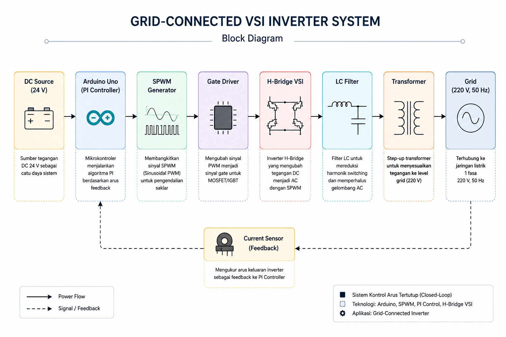
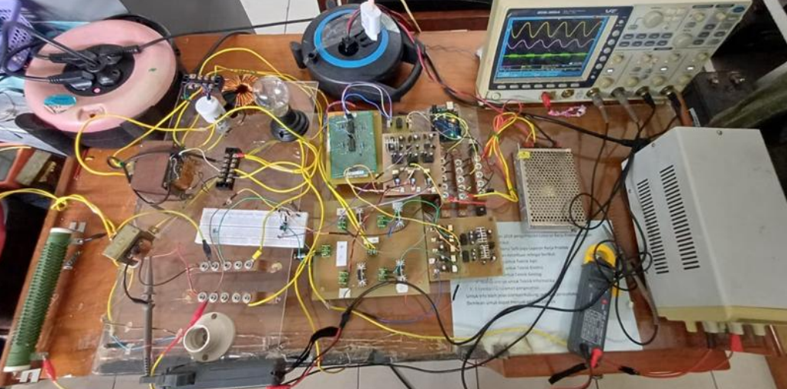
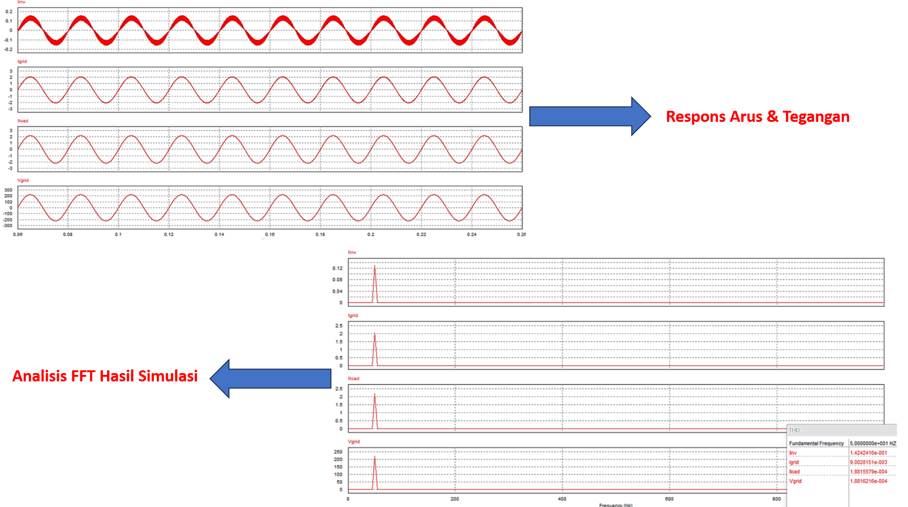

# Grid-Connected VSI Inverter with PI Current Control

Perancangan dan implementasi **Single-Phase Grid-Connected Voltage Source Inverter (VSI)** menggunakan **Proportional-Integral (PI) Current Control** berbasis **Arduino Uno** untuk menghasilkan arus keluaran yang sinkron dengan jaringan listrik.

---

## Ringkasan Proyek

Proyek ini merupakan tugas akhir Program Sarjana Teknik Elektro yang berfokus pada pengembangan inverter H-Bridge berbasis SPWM dengan kontrol arus PI. Sistem dirancang melalui simulasi menggunakan MATLAB/Simulink dan PSIM, kemudian diimplementasikan pada prototipe perangkat keras untuk mengevaluasi performa sistem terhadap jaringan listrik.

---

## Tujuan

- Merancang inverter H-Bridge satu fasa berbasis SPWM.
- Mengimplementasikan PI Current Controller pada Arduino Uno.
- Menganalisis performa sistem melalui simulasi dan implementasi.
- Mengevaluasi respons arus inverter terhadap referensi jaringan listrik.

---

## Teknologi

### Software

- MATLAB/Simulink
- PSIM
- Arduino IDE
- Proteus

### Hardware

- Arduino Uno
- IR2112 Gate Driver
- IRFP460 MOSFET
- TLP250 Optocoupler
- ACS712 Current Sensor
- LC Filter
- Step-Up Transformer

---

## Arsitektur Sistem

Diagram berikut menunjukkan arsitektur keseluruhan sistem Grid-Connected VSI Inverter dengan PI Current Control.

<p align="center">
  
</p>

---

## Implementasi Hardware

Prototype inverter yang telah direalisasikan dan digunakan pada proses implementasi serta pengujian sistem.

<p align="center">
  
</p>

---

## Hasil Simulasi

### Respons Arus dan Tegangan

Hasil simulasi menunjukkan respons arus inverter, arus jaringan, arus beban, dan tegangan jaringan yang stabil menggunakan PI Current Control.

<p align="center">
  
</p>
---

## Hasil Implementasi

Pengujian dilakukan pada beberapa nilai referensi arus (**Iref**) untuk mengevaluasi kontribusi daya inverter pada sistem Grid-Connected VSI.

| Iref (A) | Iinv (A) | Igrid (A) | Iload (A) | Vgrid (V) | Pinv (W) | Pgrid (W) | Pload (W) | PF | Kontribusi Inverter |
|---------:|---------:|----------:|----------:|----------:|---------:|----------:|----------:|---:|--------------------:|
| 0.1 | 0.13 | 2.06 | 2.19 | 220 | 14.57 | 227.37 | 241.94 | 0.99 | 6.02% |
| 0.5 | 0.65 | 1.54 | 2.19 | 220 | 72.06 | 169.86 | 241.94 | 0.99 | 29.79% |
| 1.0 | 1.41 | 0.78 | 2.19 | 220 | 155.52 | 86.42 | 241.94 | 0.99 | 64.28% |


**Ringkasan Hasil**

- Daya inverter (**Pinv**) meningkat seiring kenaikan nilai **Iref**.
- Kontribusi inverter terhadap beban meningkat hingga **64,28%** pada **Iref = 1,0 A**.
- Daya yang disuplai jaringan (**Pgrid**) menurun seiring meningkatnya kontribusi inverter.
- Faktor daya (**PF**) tetap tinggi (**0,99**) pada seluruh kondisi pengujian.

---

## Struktur Repository

```text
01_Grid_Connected_VSI_Inverter
│
├── images/
├── MATLAB_kontrol_loop_tertutup.slx
├── Rangkaian_PSIM.psimsch
├── Program_VSI_Unipolar_PWM.ino
├── Wiring_VSI_Full.pdsprj
├── Wiring_TLP250_MOSFET_SENSOR_ARUS.pdsprj
└── README.md
```

## File Utama

| File | Keterangan |
|------|------------|
| MATLAB_kontrol_loop_tertutup.slx | Simulasi PI Current Control menggunakan MATLAB/Simulink. |
| Rangkaian_PSIM.psimsch | Simulasi inverter H-Bridge pada PSIM. |
| Program_VSI_Unipolar_PWM.ino | Implementasi algoritma SPWM dan PI Current Control pada Arduino Uno. |
| Wiring_VSI_Full.pdsprj | Desain rangkaian hardware inverter. |
| Wiring_TLP250_MOSFET_SENSOR_ARUS.pdsprj | Rangkaian gate driver dan sensor arus. |
