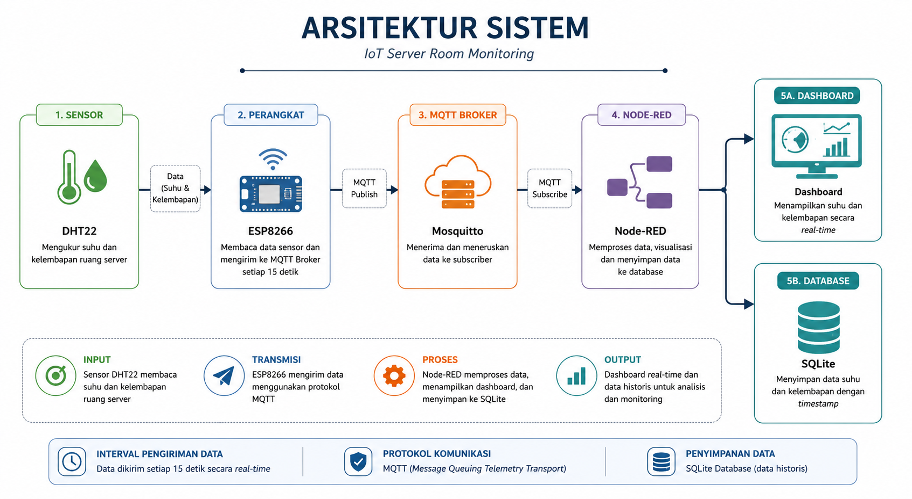

# IoT Server Room Monitoring

Sistem **monitoring suhu dan kelembapan ruang server** berbasis **Internet of Things (IoT)** menggunakan **ESP8266**, **DHT22**, **MQTT**, **Node-RED**, dan **SQLite**. Sistem mengirim data setiap **15 detik**, menampilkan kondisi secara **real-time**, serta menyimpan data historis.

---

## Teknologi

**Hardware**
- ESP8266
- DHT22

**Software**
- Arduino IDE
- MQTT (Mosquitto)
- Node-RED
- SQLite
- Docker

---

## Arsitektur Sistem

**Keterangan:** Data suhu dan kelembapan dibaca oleh **sensor DHT22**, dikirim melalui **ESP8266** menggunakan **protokol MQTT**, diproses oleh **Node-RED**, kemudian ditampilkan pada **dashboard** dan disimpan ke **database SQLite** untuk analisis historis.

---

## Prototype Hardware

---

## Dashboard Monitoring

---

## Database Monitoring

---

## Fitur

- Real-time Monitoring
- MQTT Communication
- Node-RED Dashboard
- SQLite Data Logging
- Docker Deployment

---

## Kompetensi

- Internet of Things (IoT)
- ESP8266
- MQTT
- Node-RED
- SQLite
- Docker
- Embedded System
