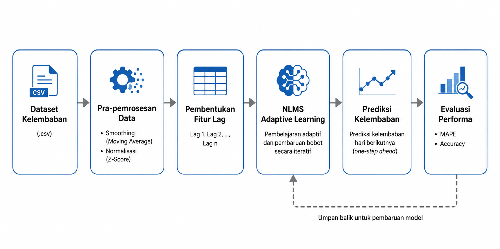

# Sistem prediksi kelembapan harian menggunakan algoritma Normalized Least Mean Square (NLMS)

Sistem prediksi kelembapan harian menggunakan algoritma **Normalized Least Mean Square (NLMS)** berbasis Python. Model menerapkan adaptive filtering untuk memprediksi kelembapan berdasarkan data historis melalui preprocessing, pembentukan lag feature, dan optimasi parameter.

---

## Teknologi

**Programming Language**
- Python

**Libraries**
- NumPy
- Pandas
- Matplotlib
- Scikit-learn
- Numba

---

## Arsitektur Sistem

Diagram berikut menunjukkan alur prediksi kelembapan menggunakan algoritma NLMS.

  

---

## Hasil Implementasi

  

---

## Kompetensi

- Adaptive Signal Processing
- Normalized Least Mean Square (NLMS)
- Time Series Prediction
- Python Programming
- Data Preprocessing
- Hyperparameter Tuning
- Data Visualization
