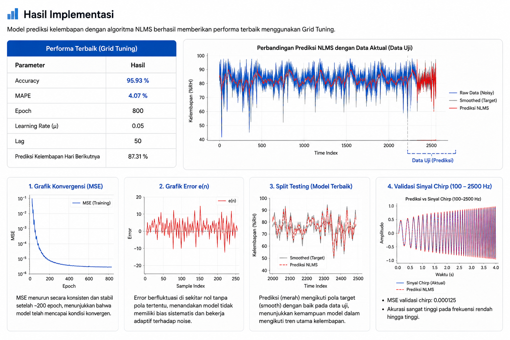

# Sistem Prediksi Kelembapan Harian menggunakan algoritma NLMS

Sistem prediksi kelembapan harian menggunakan algoritma **Normalized Least Mean Square (NLMS)** berbasis Python. Model menerapkan adaptive filtering untuk memprediksi kelembapan berdasarkan data historis melalui preprocessing, pembentukan lag feature, dan optimasi parameter.

---

## Teknologi

**Programming Language**
- Python

**Libraries**
- NumPy
- Pandas
- Matplotlib
- Scikit-learn
- Numba

---

## Arsitektur Sistem

Diagram berikut menunjukkan alur prediksi kelembapan menggunakan algoritma NLMS.

  

---

  

---

## Kompetensi

- Adaptive Signal Processing
- Normalized Least Mean Square (NLMS)
- Time Series Prediction
- Python Programming
- Data Preprocessing
- Hyperparameter Tuning
- Data Visualization
---
## File Utama

| File | Keterangan |
|------|------------|
| Program_NLMS.py | Implementasi algoritma Normalized Least Mean Square (NLMS) untuk prediksi kelembapan harian. |
| Humidity_Data.csv | Dataset kelembapan yang digunakan untuk proses pelatihan dan evaluasi model. |
| requirements.txt | Daftar library Python yang dibutuhkan untuk menjalankan program. |
---
