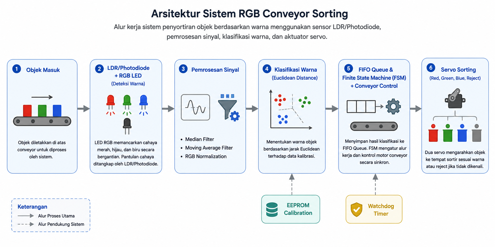
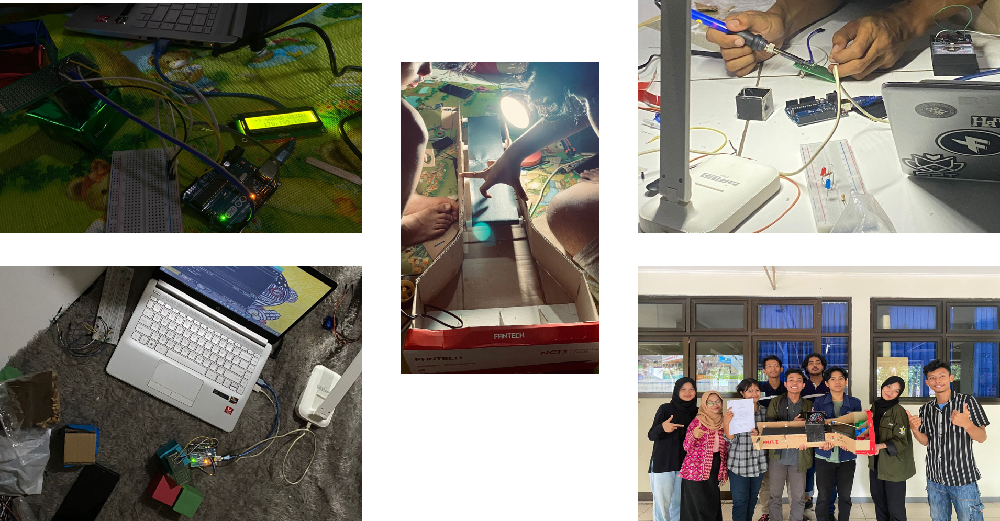

# RGB Conveyor Sorting System

Perancangan dan implementasi sistem penyortiran objek berdasarkan warna menggunakan **Arduino Uno**, **LED RGB**, **LDR/Photodiode**, **motor DC conveyor**, dan **dua motor servo**. Sistem mengidentifikasi warna objek melalui pemrosesan sinyal pantulan cahaya, kemudian melakukan penyortiran secara otomatis berdasarkan hasil klasifikasi.

---

## Ringkasan Proyek

Proyek ini mengembangkan sistem penyortiran objek otomatis berbasis embedded system sebagai implementasi otomasi industri. Identifikasi warna dilakukan menggunakan LED RGB dan sensor LDR/Photodiode, kemudian diproses melalui filtering, normalisasi RGB, dan algoritma **Euclidean Distance** sebelum objek disortir menggunakan dua motor servo.

---

## Teknologi

### Software

- Arduino IDE
- C/C++
- Proteus

### Hardware

- Arduino Uno
- L298N Motor Driver
- Motor DC Conveyor
- Servo Motor (2 Unit)
- RGB LED
- LDR / Photodiode
- Push Button
- Power Supply 5V / 12V

---

## Arsitektur Sistem

Diagram berikut menunjukkan alur kerja sistem mulai dari deteksi warna objek hingga proses penyortiran otomatis menggunakan conveyor dan motor servo.

  

---

## Implementasi Hardware

Prototype sistem terdiri atas conveyor berbasis motor DC, LED RGB sebagai sumber pencahayaan, sensor LDR/Photodiode sebagai pembaca pantulan cahaya, dan dua motor servo sebagai aktuator penyortiran.

  

---

## Hasil Implementasi

Sistem berhasil mengidentifikasi serta menyortir objek berdasarkan warna menggunakan algoritma Euclidean Distance dengan dukungan filtering dan normalisasi RGB.
---
### Ringkasan Hasil

- Mendeteksi objek berwarna merah, hijau, dan biru secara otomatis.
- Median Filter dan Moving Average Filter meningkatkan kestabilan pembacaan sensor.
- Mekanisme conveyor dan dua servo berhasil melakukan penyortiran sesuai hasil klasifikasi.
- EEPROM menyimpan data kalibrasi sehingga tidak diperlukan kalibrasi ulang setiap sistem dinyalakan.
- Watchdog Timer meningkatkan keandalan sistem saat terjadi gangguan program.

---

## Kompetensi

- Embedded System
- Industrial Automation
- Arduino Programming
- RGB Color Detection
- Sensor Signal Processing
- Median Filter
- Moving Average Filter
- RGB Normalization
- Euclidean Distance Classification
- Finite State Machine (FSM)
---

## File Utama

| File | Keterangan |
|------|------------|
| RGB_Conveyor_Sorting_System.ino | Program utama sistem penyortiran berbasis Arduino Uno. |
| README.md | Dokumentasi proyek. |
---
